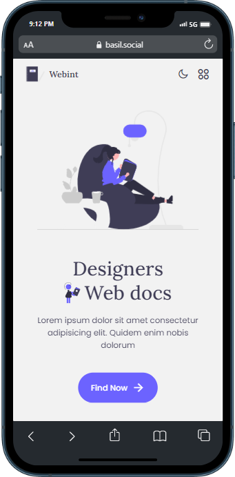
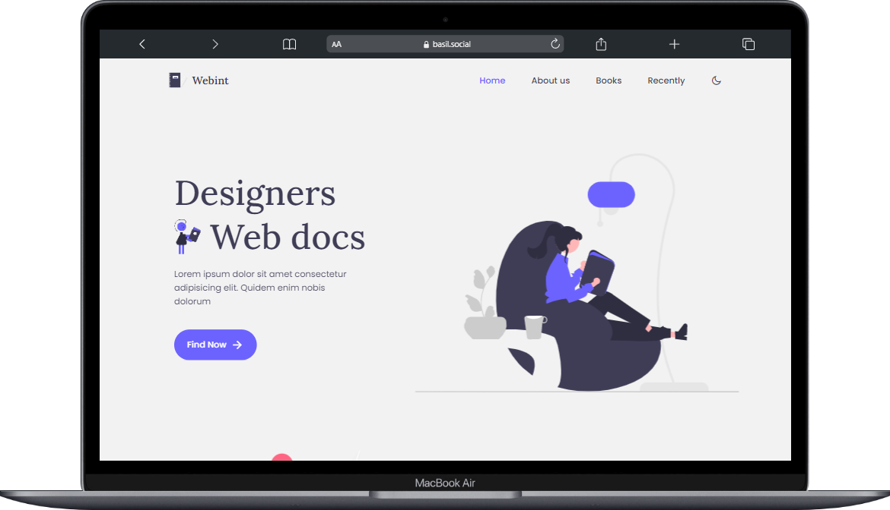

# Responsive Webint Website

## Previews

This is Our Team Website You can support 

## Features

- Responsive Website Design Using HTML CSS & JavaScript
- Includes a dark and light mode.
- Smooth scrolling in each section.
- Contains animations when scrolling.
- Developed first with the Mobile First methodology, then for desktop.
- Compatible with all mobile devices and with a beautiful and pleasant user interface.

## Support

For support, email basilxg321@gmail.com

## Demo

Insert gif or link to demo

